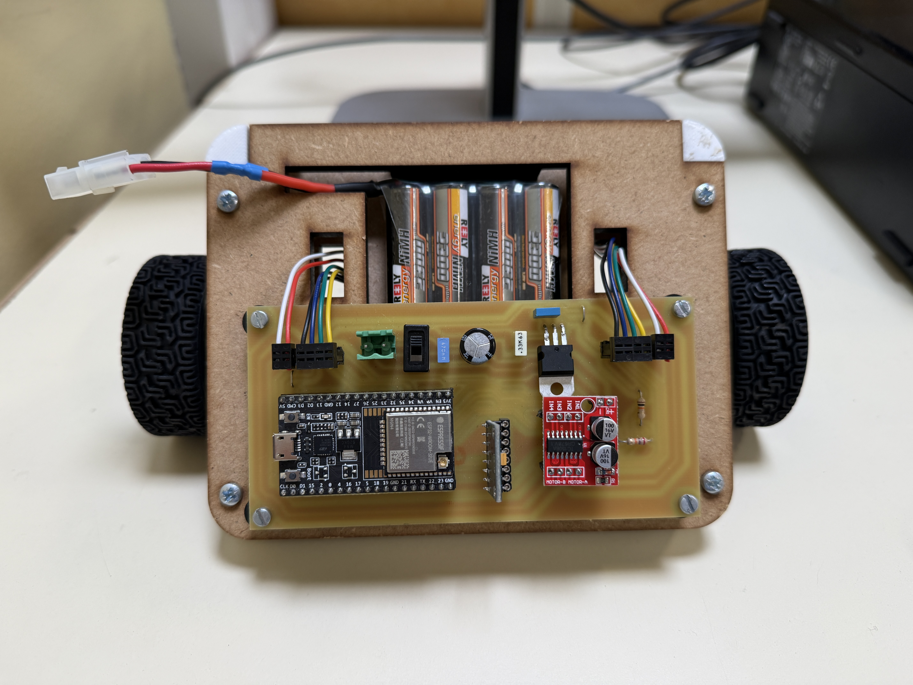
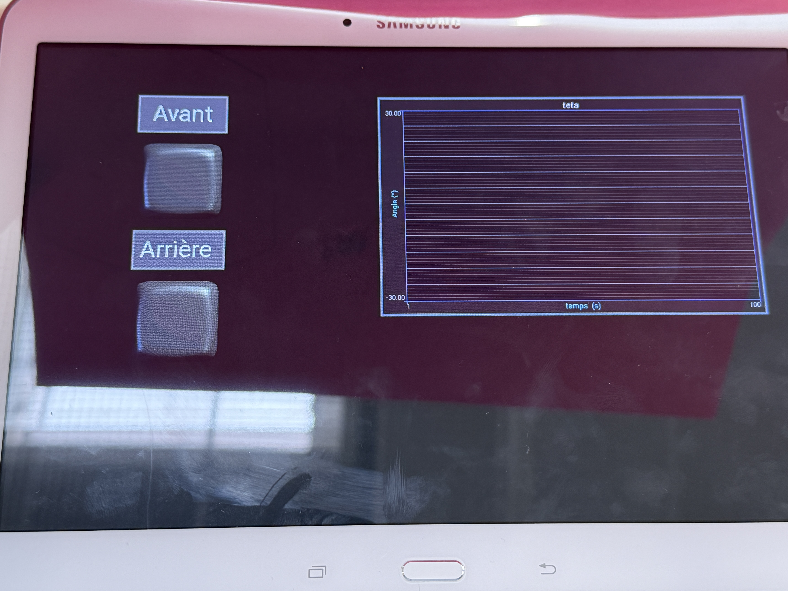

# Gyropode - Robot Auto-Équilibrant




## 📋 Description du Projet

Ce projet implémente un **robot auto-équilibrant (gyropode)** basé sur un ESP32. Le système utilise un accéléromètre/gyroscope (MPU6050) pour maintenir l'équilibre dynamiquement en ajustant la vitesse de deux moteurs via des contrôleurs PWM.

Le robot est entièrement configurable via :
- 🔌 **Connexion USB** (débogage)
- 📱 **Bluetooth** (commande en temps réel)

---

## 🎯 Fonctionnalités Principales

- **Capteur IMU (MPU6050)** : Mesure de l'accélération et de la vitesse angulaire
- **Deux moteurs avec encodeurs** : Mesure précise de la vitesse des roues
- **Contrôle PID** : Régulation du couple pour maintenir l'équilibre
- **Filtrage numérique** : Filtres passe-bas pour lisse les mesures
- **Communication Bluetooth** : Commande et tuning en temps réel
- **Communication Serial USB** : Interface de débogage

---

## ⚙️ Configuration Matérielle

### Microcontrôleur
- **Carte** : ESP32 Dev Board
- **Fréquence** : 240 MHz
- **Mémoire** : 4 MB Flash

### Capteurs
- **IMU** : Adafruit MPU6050 (I2C)
  - Accéléromètre ±16g
  - Gyroscope ±2000°/s

### Actionneurs
- **Moteurs** : 2 moteurs DC avec réducteur
- **Encodeurs** : 2 encodeurs rotatifs (748 tops/tour)
- **Drivers PWM** : 4 canaux PWM (20 kHz, 10 bits)

### Connectiques
| Fonction | Broche ESP32 |
|----------|-------------|
| Encodeur G - CLK | 35 |
| Encodeur G - DT | 34 |
| Encodeur D - CLK | 33 |
| Encodeur D - DT | 32 |
| Moteur G+ (PWM) | 19 (CH0) |
| Moteur G- (PWM) | 18 (CH1) |
| Moteur D+ (PWM) | 23 (CH2) |
| Moteur D- (PWM) | 17 (CH3) |
| SDA I2C (MPU6050) | GPIO21 |
| SCL I2C (MPU6050) | GPIO22 |

---

## 📦 Dépendances

Les bibliothèques requises sont automatiquement installées par PlatformIO :

```ini
adafruit/Adafruit MPU6050@^2.2.8      # Capteur IMU
madhephaestus/ESP32Encoder@^0.12.0    # Décodage encodeur
BluetoothSerial (intégré ESP32 Arduino)
```

---

## 🚀 Installation & Utilisation

### 1. Prérequis
- PlatformIO IDE (VS Code) ou Arduino IDE
- Driver USB CH340 (pour l'ESP32)
- Environnement de développement ESP32

### 2. Configuration du Projet

Cloner et ouvrir le projet :
```bash
git clone <repo_url>
cd gyropode_nb
```

Le fichier `platformio.ini` est préconfiguré pour l'ESP32 Dev.

### 3. Compilation et Upload

Avec PlatformIO (VS Code) :
```bash
# Compiler
platformio run

# Upload sur l'ESP32
platformio run --target upload

# Ouvrir le moniteur série
platformio device monitor --baud 115200
```

Avec Arduino IDE :
- Sélectionner **ESP32 Dev Board**
- Port : COM (détecté automatiquement)
- Baudrate : 115200

---

## 🎮 Commandes de Contrôle

Le système accepte des commandes via Bluetooth ou Serial USB au format :
```
<PARAMETRE> <VALEUR>
```

### Paramètres Disponibles

| Commande | Description | Défaut | Plage |
|----------|-------------|--------|-------|
| `Tau` | Constante de temps filtre angle (ms) | 200 | 0-1000 |
| `Te` | Période d'échantillonnage (ms) | 5 | 1-100 |
| `Kp` | Gain proportionnel PID | 3.195 | 0-10 |
| `Kd` | Gain dérivé PID | 0.07 | 0-1 |
| `C0` | Compensation des frottements secs | 0.134 | 0-0.5 |
| `TauV` | Constante de temps filtre vitesse (ms) | 115 | 0-1000 |
| `Kpv` | Gain PID vitesse | 0.7 | 0-5 |
| `Kdv` | Gain dérivé PID vitesse | 0 | 0-1 |
| `vit` | Consigne de vitesse (m/s) | 0 | ±0.5 |

### Exemples de Commandes

```
# Via Bluetooth/Serial
Kp 3.5        # Change le gain Kp
vit 0.3       # Consigne vitesse 0.3 m/s
Tau 250       # Ajuste le filtre angle
```

---

## 🔧 Algorithme de Contrôle

### 1. **Acquisition des Données**
- Lecture MPU6050 (accélération, vitesse angulaire)
- Lecture des encodeurs (position roues)

### 2. **Calcul de l'Angle**
```
θ_gravité = atan2(acc_y, acc_x)           # Angle via accéléromètre
θ_filtré = A·θ_gravité + B·θ_filtré_old  # Filtre passe-bas
θ_gyro = A·Tau/1000·(-ωz) + B·θ_gyro_old # Intégration gyroscope
θ = θ_filtré + θ_gyro + offset             # Angle total estimé
```

### 3. **Régulation de Vitesse**
```
v_moy = (v_moteur_gauche + v_moteur_droit) / 2
erreur_v = v_moy_filtrée - v_consigne
θ_consigne = -Kpv·erreur_v - Kdv·d(erreur_v)/dt
```

### 4. **Régulation d'Équilibre (PID)**
```
commande = Kp·(θ_consigne - θ) + Kd·ωz
Saturation : -0.48 ≤ commande ≤ +0.48
```

### 5. **Commande Moteurs**
```
PWM_moteur_G = (0.5 + commande) × 1023
PWM_moteur_D = (0.5 - commande) × 1023
```

---

## 📊 Architecture Logicielle

### Tâches FreeRTOS
- **Tâche `controle` (Priorité 10)** : Boucle de contrôle à Te ms
  - Lecture capteurs
  - Calculs PID
  - Commande PWM

### Boucle Principale
- Traitement des commandes Bluetooth/Serial
- Envoi de données de télémétrie
- Mode debug avec affichage console

---

## 🐛 Débogage

Le code dispose de plusieurs lignes de debug commentées pour surveiller les grandeurs internes :

```cpp
// Décommenter pour visualiser dans le moniteur série
// Serial.printf("%f %f\n", vitMoyF, teta_cons);
// SerialBT.printf("%.2f %.2f\n", vitMoyF, teta * 180 / M_PI);
```

### Vitesses de Communication
- **USB Serial** : 115200 baud
- **Bluetooth** : Nom "Gyropode_NB"

---

## 📝 Paramètres Calibration (à Ajuster)

Ces valeurs dépendent de la mécanique et doivent être tuées :

```cpp
float Kp = 3.195;        // Gain proportionnel
float Kd = 0.07;         // Gain dérivé
float C0 = 0.134;        // Compensation frottements
float Kpv = 0.7;         // Gain vitesse
float Tau = 200;         // Filtre angle (ms)
float TauV = 115;        // Filtre vitesse (ms)
```

**Procédure de tuning recommandée** :
1. Commencer avec Kp faible (ex: 1.0)
2. Augmenter progressivement jusqu'à stabilité
3. Ajouter Kd si oscillations
4. Ajuster Tau pour lisser le signal
5. Calibrer les frottements (C0)

---

## 🔌 Schéma de Brochage

```
         ESP32 Dev Board
    ┌─────────────────────┐
    │                     │
    │  GPIO35 ←── CLK₁   │ (Encodeur G)
    │  GPIO34 ←── DT₁    │
    │                     │
    │  GPIO33 ←── CLK₂   │ (Encodeur D)
    │  GPIO32 ←── DT₂    │
    │                     │
    │  GPIO19 ──→ PWM G+ │
    │  GPIO18 ──→ PWM G- │
    │  GPIO23 ──→ PWM D+ │
    │  GPIO17 ──→ PWM D- │
    │                     │
    │  GPIO21 ↔──── SDA  │ (MPU6050)
    │  GPIO22 ↔──---- SCL  │
    │                     │
    └─────────────────────┘
```

---

## 📚 Ressources Utiles

- [Documentation PlatformIO](https://docs.platformio.org/)
- [ESP32 Arduino Core](https://github.com/espressif/arduino-esp32)
- [Adafruit MPU6050](https://github.com/adafruit/Adafruit_MPU6050)
- [ESP32Encoder](https://github.com/madhephaestus/ESP32Encoder)

---

## 📄 Licence

Ce projet est fourni à titre d'exemple éducatif.

---

## 👤 Auteur

Projet de Mécatronique - Gyropode Auto-Équilibrant

**Date** : Avril 2026

---

## 📞 Support & Questions

Pour des questions ou améliorations, consultez les fichiers de configuration et le code source commenté.
